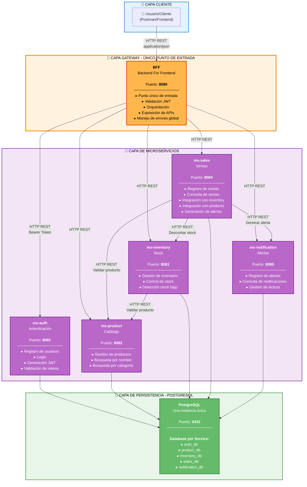

# Sistema de Gestión Integral para Ferretería

## Descripción General

El presente proyecto consiste en el desarrollo de una solución basada en arquitectura de microservicios para una ferretería de barrio que actualmente realiza la mayoría de sus procesos de forma manual mediante registros en papel.

La ferretería enfrenta diversos problemas operativos derivados de la falta de digitalización de sus procesos, afectando la gestión de inventario, ventas y control de productos.

La solución propuesta permite digitalizar y automatizar las operaciones críticas del negocio, centralizando la información y mejorando la trazabilidad, disponibilidad y confiabilidad de los datos.

---

# Problemática del Negocio

## Situación Actual 

Actualmente la ferretería administra:

- Inventario en papel.
- Registro de productos manual.
- Ventas registradas en cuadernos.
- Control de stock manual.
- Seguimiento de ventas manual.
- Alertas inexistentes para stock bajo.

### Problemas Detectados

- Pérdida frecuente de documentos físicos.
- Errores de digitación.
- Desconocimiento del stock real disponible.
- Falta de trazabilidad de ventas.
- Lentitud en la atención al cliente.
- Dificultad para detectar productos con stock bajo.
- Riesgo de vender productos sin existencia.
- Falta de información para la toma de decisiones.

---

# Solución Propuesta (TO-BE)

Se desarrolló una plataforma basada en microservicios que permite:

- Gestionar productos digitalmente.
- Controlar inventario en tiempo real.
- Registrar ventas automáticamente.
- Descontar stock de forma automática.
- Generar alertas de stock bajo.
- Consultar información centralizada.
- Proteger accesos mediante JWT.
- Facilitar la escalabilidad futura del sistema.

---

# Objetivos

## Objetivo General

Diseñar e implementar una plataforma de gestión integral para una ferretería de barrio utilizando arquitectura de microservicios.

## Objetivos Específicos

- Digitalizar el catálogo de productos.
- Automatizar el control de inventario.
- Registrar ventas de manera segura.
- Implementar autenticación basada en JWT.
- Generar alertas de stock bajo.
- Centralizar la información del negocio.
- Mejorar la trazabilidad de las operaciones.

---

# Arquitectura del Sistema

El sistema utiliza una arquitectura de microservicios, permitiendo que cada componente tenga una responsabilidad específica y pueda evolucionar de forma independiente.

## Ventajas

- Escalabilidad.
- Mantenibilidad.
- Bajo acoplamiento.
- Despliegue independiente.
- Mejor organización del dominio de negocio.
- Facilidad de integración futura.

---

# Arquitectura Implementada

## BFF (Backend For Frontend)

Puerto: **8080**

Responsabilidades:

- Punto único de entrada.
- Validación de JWT.
- Orquestación de microservicios.
- Exposición de endpoints al cliente.

---

## ms-auth

Puerto: **8081**

Responsabilidades:

- Registro de usuarios.
- Inicio de sesión.
- Generación de JWT.
- Validación de tokens.

---

## ms-product

Puerto: **8082**

Responsabilidades:

- Gestión de productos.
- Catálogo de productos.
- Búsqueda por nombre.
- Búsqueda por categoría.

---

## ms-inventory

Puerto: **8083**

Responsabilidades:

- Gestión de stock.
- Control de bodegas.
- Ajuste de inventario.
- Detección de stock bajo.

---

## ms-sales

Puerto: **8084**

Responsabilidades:

- Registro de ventas.
- Consulta de ventas.
- Integración con inventario.
- Integración con productos.
- Generación de alertas.

---

## ms-notification

Puerto: **8085**

Responsabilidades:

- Registro de notificaciones.
- Consulta de alertas.
- Gestión de estados de lectura.

---

# Persistencia de Datos

El proyecto implementa el patrón:

## Database per Service

Cada microservicio posee su propia base de datos lógica.

| Microservicio | Base de Datos |
|-------------|-------------|
| ms-auth | auth_db |
| ms-product | product_db |
| ms-inventory | inventory_db |
| ms-sales | sales_db |
| ms-notification | notification_db |

Todas las bases de datos se ejecutan sobre una única instancia PostgreSQL para simplificar el despliegue académico mediante Docker.

---

# Puertos del Sistema

| Servicio | Puerto |
|-----------|---------|
| BFF | 8080 |
| ms-auth | 8081 |
| ms-product | 8082 |
| ms-inventory | 8083 |
| ms-sales | 8084 |
| ms-notification | 8085 |
| PostgreSQL | 5432 |

---

# Diagrama C2 – Arquitectura General



---

# Diagrama C3 – Arquitectura Interna del BFF

```mermaid
graph TB
    subgraph Request["📨 ENTRADA DE REQUEST"]
        ClientReq["Cliente HTTP<br/>(Postman/Frontend)"]
    end

    subgraph SecurityLayer["🔐 CAPA DE SEGURIDAD"]
        SecurityFilterChain["<b>SecurityFilterChain</b><br/>─────────────────<br/>Ordena filtros<br/>Configura políticas"]
        
        JwtFilter["<b>JwtAuthenticationFilter</b><br/><b>(Ejecuta PRIMERO)</b><br/>─────────────────<br/>▸ Extrae token del header<br/>▸ Llama AuthClient.validate<br/>▸ Configura SecurityContext<br/>▸ Si falla, rechaza (401)"]
        
        AuthClientSec["<b>AuthClient</b><br/>─────────────────<br/>Comunica con:<br/>ms-auth:8081<br/>Endpoint: /auth/validate"]
    end

    subgraph ControllerLayer["🎮 CAPA DE CONTROLADORES (REST)"]
        AuthCtrl["<b>AuthController</b><br/>Ruta: /api/auth<br/>─────────────────<br/>POST /register<br/>POST /login"]
        
        ProductCtrl["<b>ProductController</b><br/>Ruta: /api/products<br/>─────────────────<br/>GET / (listar)<br/>GET /{id}<br/>GET /buscar<br/>GET /categoria/{cat}<br/>POST / (crear)<br/>PUT /{id} (actualizar)"]
        
        InventoryCtrl["<b>InventoryController</b><br/>Ruta: /api/inventory<br/>─────────────────<br/>GET / (listar)<br/>GET /stock-bajo<br/>GET /producto/{id}<br/>POST / (crear)<br/>PUT /{id} (ajustar)"]
        
        SalesCtrl["<b>SalesController</b><br/>Ruta: /api/sales<br/>─────────────────<br/>POST / (registrar)<br/>GET / (listar)<br/>GET /{id}<br/>GET /producto/{id}<br/>GET /resumen"]
        
        NotificationCtrl["<b>NotificationController</b><br/>Ruta: /api/notifications<br/>─────────────────<br/>GET / (listar)<br/>PUT /{id} (marcar lectura)<br/>GET /sin-leer"]
        
        HealthCtrl["<b>HealthController</b><br/>Ruta: /health<br/>─────────────────<br/>(Acceso público)"]
    end

    subgraph ServiceLayer["⚙️ CAPA DE SERVICIOS (Orquestación)"]
        AuthSvc["<b>AuthBffService</b><br/>─────────────────<br/>Delega a:<br/>AuthClient"]
        
        ProductSvc["<b>ProductBffService</b><br/>─────────────────<br/>Delega a:<br/>ProductClient"]
        
        InventorySvc["<b>InventoryBffService</b><br/>─────────────────<br/>Delega a:<br/>InventoryClient"]
        
        SalesSvc["<b>SalesBffService</b><br/>─────────────────<br/>Delega a:<br/>SalesClient"]
        
        NotificationSvc["<b>NotificationBffService</b><br/>─────────────────<br/>Delega a:<br/>NotificationClient"]
    end

    subgraph ClientLayer["🌐 CAPA DE CLIENTES HTTP (RestClient)"]
        AuthClientHttp["<b>AuthClient</b><br/>Qualificado: authRestClient<br/>─────────────────<br/>ms-auth:8081<br/>/auth/register<br/>/auth/login<br/>/auth/validate"]
        
        ProductClientHttp["<b>ProductClient</b><br/>Qualificado: productRestClient<br/>─────────────────<br/>ms-product:8082<br/>Múltiples endpoints"]
        
        InventoryClientHttp["<b>InventoryClient</b><br/>Qualificado: inventoryRestClient<br/>─────────────────<br/>ms-inventory:8083<br/>Múltiples endpoints"]
        
        SalesClientHttp["<b>SalesClient</b><br/>Qualificado: salesRestClient<br/>─────────────────<br/>ms-sales:8084<br/>Múltiples endpoints"]
        
        NotificationClientHttp["<b>NotificationClient</b><br/>Qualificado: notificationRestClient<br/>─────────────────<br/>ms-notification:8085<br/>Múltiples endpoints"]
    end

    subgraph Config["⚙️ CONFIGURACIÓN"]
        RestClientConfig["<b>RestClientConfig</b><br/>─────────────────<br/>Crea 5 RestClient beans<br/>Uno por microservicio<br/>Define URLs base desde<br/>application.properties"]
    end

    subgraph ExceptionHandling["❌ MANEJO DE ERRORES"]
        GlobalExceptionHandler["<b>GlobalExceptionHandler</b><br/>─────────────────<br/>Captura excepciones<br/>Transforma a JSON<br/>Retorna respuestas uniformes"]
    end

    subgraph ExternalServices["🔗 MICROSERVICIOS EXTERNOS"]
        MSAuth["<b>ms-auth:8081</b>"]
        MSProduct["<b>ms-product:8082</b>"]
        MSInventory["<b>ms-inventory:8083</b>"]
        MSSales["<b>ms-sales:8084</b>"]
        MSNotification["<b>ms-notification:8085</b>"]
    end

    %% FLUJO DE UNA REQUEST PROTEGIDA
    ClientReq -->|HTTP + Headers<br/>Authorization: Bearer| SecurityFilterChain
    
    SecurityFilterChain -->|Ordena filtros| JwtFilter
    
    JwtFilter -->|Extrae token<br/>Valida| AuthClientSec
    AuthClientSec -->|POST /auth/validate| MSAuth
    
    JwtFilter -->|Token válido<br/>SecurityContext| ProductCtrl
    JwtFilter -->|Token válido<br/>SecurityContext| InventoryCtrl
    JwtFilter -->|Token válido<br/>SecurityContext| SalesCtrl
    JwtFilter -->|Token válido<br/>SecurityContext| NotificationCtrl
    JwtFilter -->|Token válido<br/>SecurityContext| AuthCtrl
    
    %% FLUJO DE CONTROLLERS → SERVICES
    AuthCtrl --> AuthSvc
    ProductCtrl --> ProductSvc
    InventoryCtrl --> InventorySvc
    SalesCtrl --> SalesSvc
    NotificationCtrl --> NotificationSvc
    
    %% FLUJO DE SERVICES → CLIENTS
    AuthSvc --> AuthClientHttp
    ProductSvc --> ProductClientHttp
    InventorySvc --> InventoryClientHttp
    SalesSvc --> SalesClientHttp
    NotificationSvc --> NotificationClientHttp
    
    %% FLUJO DE CLIENTS → MICROSERVICIOS
    AuthClientHttp --> MSAuth
    ProductClientHttp --> MSProduct
    InventoryClientHttp --> MSInventory
    SalesClientHttp --> MSSales
    NotificationClientHttp --> MSNotification
    
    %% MANEJO DE ERRORES
    AuthCtrl -.->|Si excepción| GlobalExceptionHandler
    ProductCtrl -.->|Si excepción| GlobalExceptionHandler
    InventoryCtrl -.->|Si excepción| GlobalExceptionHandler
    SalesCtrl -.->|Si excepción| GlobalExceptionHandler
    NotificationCtrl -.->|Si excepción| GlobalExceptionHandler
    
    %% CONFIGURACIÓN
    RestClientConfig -.->|Proporciona beans| AuthClientHttp
    RestClientConfig -.->|Proporciona beans| ProductClientHttp
    RestClientConfig -.->|Proporciona beans| InventoryClientHttp
    RestClientConfig -.->|Proporciona beans| SalesClientHttp
    RestClientConfig -.->|Proporciona beans| NotificationClientHttp

    %% ESTILOS
    style Request fill:#e3f2fd,stroke:#1976d2,stroke-width:2px,color:#000
    style SecurityLayer fill:#ffebee,stroke:#c62828,stroke-width:3px,color:#000
    style ControllerLayer fill:#f3e5f5,stroke:#6a1b9a,stroke-width:2px,color:#fff
    style ServiceLayer fill:#e8f5e9,stroke:#2e7d32,stroke-width:2px,color:#000
    style ClientLayer fill:#fff3e0,stroke:#e65100,stroke-width:2px,color:#000
    style Config fill:#f0f4c3,stroke:#9e9d24,stroke-width:2px,color:#000
    style ExceptionHandling fill:#ffccbc,stroke:#d84315,stroke-width:2px,color:#000
    style ExternalServices fill:#fce4ec,stroke:#880e4f,stroke-width:2px,color:#000
    
    style JwtFilter fill:#ef5350,stroke:#c62828,stroke-width:3px,color:#fff
    style SecurityFilterChain fill:#f44336,stroke:#c62828,stroke-width:2px,color:#fff
```



---

# Explicación Técnica de los Diagramas C2 y C3

## Diagrama C2: Arquitectura General del Sistema

### Componentes Principales

**1. Capa Cliente**
- Usuario o cliente (Postman, Frontend, etc.)
- Se comunica únicamente con el BFF mediante HTTP REST
- Envía token JWT en el header `Authorization: Bearer <token>`

**2. Capa Gateway (BFF - Puerto 8080)**
El BFF es el **único punto de entrada** al sistema:
- Realiza validación de JWT antes de procesar cualquier solicitud
- Orquesta llamadas a los microservicios
- Centraliza el manejo de errores (GlobalExceptionHandler)
- Transforma respuestas y normaliza formatos
- Expone documentación Swagger

**3. Capa de Microservicios**
Cinco microservicios independientes con responsabilidades específicas:
- **ms-auth (8081):** Gestión de autenticación y generación de JWT
- **ms-product (8082):** Catálogo de productos
- **ms-inventory (8083):** Control de inventario
- **ms-sales (8084):** Registro y consulta de ventas
- **ms-notification (8085):** Sistema de alertas

**4. Capa de Persistencia**
Una única instancia PostgreSQL (5432) con patrón **Database per Service**:
- Cada microservicio tiene su propia base de datos lógica
- Garantiza independencia y bajo acoplamiento
- Simplifica el despliegue académico mediante Docker

### Flujos de Comunicación

**Flujo Cliente → BFF → Microservicio:**
```
Usuario → BFF:8080 (Bearer Token) → Microservicio:PORT → PostgreSQL
```

**Coordinación entre Microservicios (Orquestación):**
```
ms-sales:8084 → ms-product:8082 (validar producto)
ms-sales:8084 → ms-inventory:8083 (descontar stock)
ms-sales:8084 → ms-notification:8085 (generar alerta)
ms-inventory:8083 → ms-product:8082 (validar producto)
```

---

## Diagrama C3: Arquitectura Interna del BFF

### Capas de Procesamiento

**1. Capa de Seguridad (🔐)**
La seguridad se implementa en dos niveles:

- **SecurityFilterChain:**
  - Configura la cadena de filtros de Spring Security
  - Define rutas públicas y protegidas
  - Configura CORS, CSRF, sesiones stateless

- **JwtAuthenticationFilter:**
  - Ejecuta **PRIMERO** en la cadena de filtros
  - Extrae el token del header `Authorization: Bearer <token>`
  - Llama a `AuthClient.validateToken(token)`
  - Valida contra `ms-auth:8081/auth/validate`
  - Si es válido, configura el `SecurityContext`
  - Si falla, rechaza la solicitud (401 Unauthorized)

**Rutas Públicas (sin JWT):**
- `/api/auth/login` - Autenticación
- `/api/auth/register` - Registro
- `/health` - Health check
- `/api-docs/**` - Documentación
- `/swagger-ui/**` - Swagger UI

**2. Capa de Controladores (🎮)**
Seis controladores REST exponen los servicios del BFF:

| Controlador | Ruta | Responsabilidad |
|---|---|---|
| AuthController | `/api/auth` | Login, registro (sin JWT) |
| HealthController | `/health` | Health check (sin JWT) |
| ProductController | `/api/products` | Consulta y CRUD de productos |
| InventoryController | `/api/inventory` | Gestión de inventario |
| SalesController | `/api/sales` | Registro y consulta de ventas |
| NotificationController | `/api/notifications` | Consulta de alertas |

**3. Capa de Servicios (⚙️)**
Cinco servicios orquestadores que **delegan** a los clientes HTTP:

- **AuthBffService:** Delega a AuthClient
- **ProductBffService:** Delega a ProductClient
- **InventoryBffService:** Delega a InventoryClient
- **SalesBffService:** Delega a SalesClient
- **NotificationBffService:** Delega a NotificationClient

> **Nota:** El BFF NO contiene lógica de negocio compleja. Es un patrón de **orquestación simple** donde el servicio delega directamente al cliente. La lógica compleja (validar producto, descontar stock, generar alertas) reside en los microservicios.

**4. Capa de Clientes HTTP (🌐)**
Cinco clientes HTTP comunican con los microservicios usando RestClient:

```java
@Component
public class AuthClient {
    private final RestClient restClient;
    
    public AuthClient(@Qualifier("authRestClient") RestClient restClient) {
        this.restClient = restClient;
    }
    
    public ValidateTokenResponseDto validateToken(String token) {
        return restClient.post().uri("/auth/validate")
                .body(new ValidateTokenRequestDto(token))
                .retrieve().body(ValidateTokenResponseDto.class);
    }
}
```

Cada cliente está calificado con un bean específico:
- `@Qualifier("authRestClient")` → ms-auth:8081
- `@Qualifier("productRestClient")` → ms-product:8082
- `@Qualifier("inventoryRestClient")` → ms-inventory:8083
- `@Qualifier("salesRestClient")` → ms-sales:8084
- `@Qualifier("notificationRestClient")` → ms-notification:8085

**5. Configuración (⚙️)**
RestClientConfig crea cinco RestClient beans, uno por microservicio:

```java
@Configuration
public class RestClientConfig {
    @Value("${auth.service.url}")        private String authUrl;
    @Value("${product.service.url}")     private String productUrl;
    @Value("${inventory.service.url}")   private String inventoryUrl;
    @Value("${sales.service.url}")       private String salesUrl;
    @Value("${notification.service.url}") private String notificationUrl;

    @Bean("authRestClient")
    public RestClient authRestClient() {
        return RestClient.builder().baseUrl(authUrl).build();
    }
    // ... otros beans similares
}
```

URLs configuradas en `application.properties`:
```properties
auth.service.url=${AUTH_SERVICE_URL:http://localhost:8081}
product.service.url=${PRODUCT_SERVICE_URL:http://localhost:8082}
inventory.service.url=${INVENTORY_SERVICE_URL:http://localhost:8083}
sales.service.url=${SALES_SERVICE_URL:http://localhost:8084}
notification.service.url=${NOTIFICATION_SERVICE_URL:http://localhost:8085}
```

**6. Manejo de Errores (❌)**
GlobalExceptionHandler captura excepciones a nivel global:

```java
@RestControllerAdvice
public class GlobalExceptionHandler {
    @ExceptionHandler(UnauthorizedException.class)
    public ResponseEntity<Map<String, Object>> handleUnauthorized(UnauthorizedException ex)
    
    @ExceptionHandler(RestClientResponseException.class)
    public ResponseEntity<Map<String, Object>> handleRestClientResponse(RestClientResponseException ex)
    
    @ExceptionHandler(Exception.class)
    public ResponseEntity<Map<String, Object>> handleGeneral(Exception ex)
}
```

---

### Flujo Completo de una Request Protegida

```
1. Cliente envía: POST /api/sales con Authorization: Bearer <token>
   └─→ BFF:8080 recibe la solicitud

2. SecurityFilterChain intercepta
   └─→ Ordena los filtros de seguridad

3. JwtAuthenticationFilter ejecuta PRIMERO
   ├─→ Extrae token del header
   ├─→ Llama a AuthClient.validateToken(token)
   ├─→ AuthClient → POST ms-auth:8081/auth/validate
   ├─→ Si válido: configura SecurityContext
   └─→ Si inválido: rechaza (401)

4. SalesController recibe la solicitud
   └─→ Llama a SalesBffService.register(dto)

5. SalesBffService.register()
   └─→ Llama a SalesClient.register(dto)

6. SalesClient realiza HTTP REST
   └─→ POST ms-sales:8084/sales con los datos

7. ms-sales procesa:
   ├─→ Valida producto → Llama a ms-product:8082
   ├─→ Descuenta stock → Llama a ms-inventory:8083
   └─→ Genera alerta → Llama a ms-notification:8085

8. Respuesta retorna:
   ms-sales:8084 → SalesClient → SalesBffService → SalesController → Cliente

9. Si ocurre excepción:
   └─→ GlobalExceptionHandler la captura y transforma a JSON
```

---

### Patrón Arquitectónico: API Gateway + Service Layer

**API Gateway (BFF):**
- Punto único de entrada (SPOF)
- Validación centralizada de JWT
- Enrutamiento a microservicios
- Manejo de errores global
- Transformación de respuestas

**Service Layer:**
- Orquestación simple
- Delegación al cliente HTTP
- No contiene lógica de negocio compleja

**Client Layer:**
- Comunicación con microservicios
- Manejo de protocolos HTTP
- Serialización/deserialización JSON

---

# Flujo de Negocio

## Registro de Usuario

1. Usuario solicita registro.
2. BFF envía solicitud a ms-auth.
3. ms-auth almacena usuario.
4. Se confirma el registro.

---

## Inicio de Sesión

1. Usuario envía credenciales.
2. ms-auth valida credenciales.
3. Se genera JWT.
4. JWT es retornado al usuario.

---

## Creación de Producto

1. Usuario autenticado crea producto.
2. BFF reenvía solicitud.
3. ms-product almacena producto.

---

## Registro de Inventario

1. Usuario crea inventario.
2. ms-inventory valida producto.
3. Se almacena stock inicial.

---

## Registro de Venta

1. Usuario registra venta.
2. BFF envía solicitud a ms-sales.
3. ms-sales consulta ms-product.
4. ms-sales solicita descuento de stock a ms-inventory.
5. ms-inventory actualiza existencias.
6. Si corresponde, ms-sales genera notificación.
7. ms-notification registra la alerta.
8. Se confirma la venta.

---

# Seguridad

## JWT (JSON Web Token)

El sistema utiliza JWT para proteger los endpoints.

Proceso:

1. Usuario realiza login.
2. ms-auth genera token JWT.
3. Cliente almacena token.
4. Cliente envía token mediante:

```http
Authorization: Bearer <token>
```

5. El BFF valida el token mediante ms-auth.
6. Si el token es válido, la solicitud continúa.

---

# Swagger/OpenAPI

Cada microservicio dispone de documentación Swagger.

## URLs

| Servicio | Swagger |
|-----------|-----------|
| BFF | http://localhost:8080/swagger-ui.html |
| ms-auth | http://localhost:8081/swagger-ui.html |
| ms-product | http://localhost:8082/swagger-ui.html |
| ms-inventory | http://localhost:8083/swagger-ui.html |
| ms-sales | http://localhost:8084/swagger-ui.html |
| ms-notification | http://localhost:8085/swagger-ui.html |

---

## Uso de Swagger

1. Ejecutar Login.
2. Copiar JWT.
3. Presionar botón **Authorize**.
4. Ingresar:

```text
Bearer eyJ...
```

5. Ejecutar endpoints protegidos.

---

# Tecnologías Utilizadas

- Java 21
- Spring Boot 3
- Spring Security
- Spring Validation
- PostgreSQL 16
- Docker
- Docker Compose
- OpenAPI / Swagger
- Lombok
- Gradle
- JWT
- Flyway

---

# Docker

## Construcción

```bash
docker compose -f docker-compose2.yml build
```

## Levantar Contenedores

```bash
docker compose -f docker-compose2.yml up -d
```

## Verificar Estado

```bash
docker ps
```

## Detener Servicios

```bash
docker compose -f docker-compose2.yml down
```

---

# Casos de Uso

## Registrar Usuario

Permite crear una nueva cuenta dentro del sistema.

## Gestionar Productos

Permite crear, modificar, consultar y eliminar productos.

## Gestionar Inventario

Permite controlar existencias y stock mínimo.

## Registrar Venta

Permite generar una venta y descontar inventario automáticamente.

## Consultar Notificaciones

Permite visualizar alertas generadas por el sistema.

---

# Beneficios Obtenidos

- Eliminación de registros manuales.
- Menor riesgo de pérdida de información.
- Control de stock en tiempo real.
- Mejor trazabilidad de ventas.
- Mayor velocidad de atención.
- Información centralizada.
- Escalabilidad futura.
- Arquitectura moderna basada en microservicios.

---

# Conclusión

La implementación del Sistema de Gestión Integral para Ferretería representa una modernización significativa de los procesos operativos del negocio. La migración desde registros manuales en papel hacia una plataforma digital permite mejorar la eficiencia, reducir errores humanos y aumentar la disponibilidad de información crítica para la toma de decisiones.

La adopción de una arquitectura basada en microservicios facilita la separación de responsabilidades, permitiendo que cada componente evolucione de forma independiente y mantenga un bajo nivel de acoplamiento. Asimismo, la incorporación de mecanismos de autenticación mediante JWT garantiza la protección de los recursos del sistema y el acceso controlado a la información.

El uso de Docker simplifica el despliegue y la portabilidad de la solución, mientras que Swagger proporciona documentación interactiva que facilita las pruebas y el mantenimiento de las APIs. Adicionalmente, la estrategia Database per Service mejora la independencia de los microservicios y fortalece la escalabilidad del sistema.

En conjunto, la solución desarrollada permite transformar un proceso tradicional basado en papel en una plataforma tecnológica moderna, capaz de mejorar la gestión del inventario, automatizar ventas, generar alertas oportunas y proporcionar una base sólida para futuras mejoras y crecimiento del negocio.